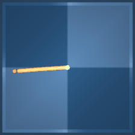
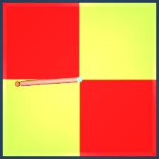
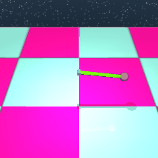
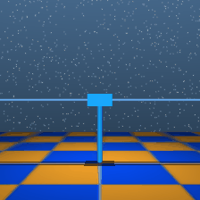
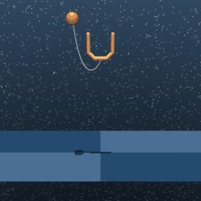
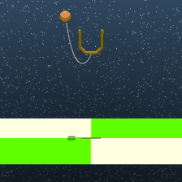
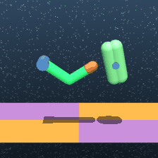

## Description

A collection of continuous control environments built on the [DeepMind Control Suite](https://github.com/google-deepmind/dm_control). These environments cover a range of classic locomotion and manipulation tasks in the [MuJoCo](https://mujoco.org/) physics engine. Some environments support multiple tasks via the `task` constructor argument. In general, the task only affects how the reward is computed.

```python
import stable_worldmodel as swm

# Example: Cheetah environment
world = swm.World('swm/CheetahDMControl-v0', num_envs=4)
```

### Available Environments

| Environment | Environment ID | Task |
|-------------|---------------|------|
| [Humanoid](#humanoid) | `swm/HumanoidDMControl-v0` | Walk forward at 1 m/s |
| [Cheetah](#cheetah) | `swm/CheetahDMControl-v0` | Run forward |
| [Hopper](#hopper) | `swm/HopperDMControl-v0` | Hop forward |
| [Reacher](#reacher) | `swm/ReacherDMControl-v0` | Reach a target |
| [Walker](#walker) | `swm/WalkerDMControl-v0` | Walk forward at 1 m/s |
| [Quadruped](#quadruped) | `swm/QuadrupedDMControl-v0` | Walk forward |
| [Acrobot](#acrobot) | `swm/AcrobotDMControl-v0` | Swing up and balance |
| [Pendulum](#pendulum) | `swm/PendulumDMControl-v0` | Swing up and balance |
| [Cartpole](#cartpole) | `swm/CartpoleDMControl-v0` | Swing up and balance |
| [Ball in Cup](#ball-in-cup) | `swm/BallInCupDMControl-v0` | Catch ball in cup |
| [Finger](#finger) | `swm/FingerDMControl-v0` | Turn spinner to target |
| [Manipulator](#manipulator) | `swm/ManipulatorDMControl-v0` | Grasp and place ball |

---

## Humanoid

A 21-DoF humanoid body that must learn to walk forward at a target speed. The task uses feature-based observations (joint angles, head height, extremities, torso orientation, center-of-mass velocity).

**Default task**: Walk forward at a speed of 1 m/s.

| Task | Description |
|------|-------------|
| `stand` | Stand upright without moving |
| `walk` (default) | Walk forward at 1 m/s |
| `run` | Run forward at 10 m/s |

```python
world = swm.World('swm/HumanoidDMControl-v0', num_envs=4)
```

### Environment Specs

| Property | Value |
|----------|-------|
| Action Space | `Box(-1, 1, shape=(21,))` — 21 joint torques |
| Observation Space | Feature vector (joint angles, head height, extremities, torso vertical, CoM velocity) |
| Episode Length | 1000 steps (25s at 0.025s timestep) |
| Environment ID | `swm/HumanoidDMControl-v0` |
| Physics | MuJoCo |

### Variation Space

| Factor | Type | Description |
|--------|------|-------------|
| `agent.color` | Box(0, 1, shape=(3,)) | Humanoid body RGB color |
| `agent.torso_density` | Box(500, 1500, shape=(1,)) | Torso geom density |
| `agent.right_lower_arm_density` | Box(500, 1500, shape=(1,)) | Right lower arm geom density |
| `agent.left_knee_locked` | Discrete(2) | Whether the left knee joint is locked |
| `floor.friction` | Box(0, 1, shape=(1,)) | Floor friction coefficient |
| `floor.color` | Box(0, 1, shape=(2, 3)) | Checkerboard floor colors |
| `light.intensity` | Box(0, 1, shape=(1,)) | Scene lighting intensity |

---

## Cheetah


A planar biped (half-cheetah) that must learn to run forward as fast as possible. The task uses feature-based observations (joint angles and velocities).

**Default task**: Run forward.

| Task | Description |
|------|-------------|
| `run` (default) | Run forward at 10 m/s |
| `run-backward` | Run backward at 10 m/s |
| `stand-front` | Stand on front foot |
| `stand-back` | Stand on back foot |
| `jump` | Jump (both feet off ground) |
| `run-front` | Run forward while lifting back foot |
| `run-back` | Run forward while lifting front foot |
| `lie-down` | Lie down flat |
| `legs-up` | Lie on back with legs up |
| `flip` | Flip forward |
| `flip-backward` | Flip backward |

```python
world = swm.World('swm/CheetahDMControl-v0', num_envs=4)
```

### Environment Specs

| Property | Value |
|----------|-------|
| Action Space | `Box(-1, 1, shape=(6,))` — 6 joint torques |
| Observation Space | Feature vector (joint angles, joint velocities) |
| Episode Length | 1000 steps (25s at 0.025s timestep) |
| Environment ID | `swm/CheetahDMControl-v0` |
| Physics | MuJoCo |

### Variation Space

| Factor | Type | Description |
|--------|------|-------------|
| `agent.color` | Box(0, 1, shape=(3,)) | Cheetah body RGB color |
| `agent.torso_density` | Box(500, 1500, shape=(1,)) | Torso geom density |
| `agent.back_foot_density` | Box(500, 1500, shape=(1,)) | Back foot geom density |
| `agent.back_foot_locked` | Discrete(2) | Whether the back foot joint is locked |
| `floor.friction` | Box(0, 1, shape=(1,)) | Floor friction coefficient |
| `floor.color` | Box(0, 1, shape=(2, 3)) | Checkerboard floor colors |
| `light.intensity` | Box(0, 1, shape=(1,)) | Scene lighting intensity |


---

## Hopper


A planar one-legged hopper that must learn to hop forward. The task uses feature-based observations (joint angles, velocities, touch sensor).

**Default task**: Hop forward at 2 m/s.

| Task | Description |
|------|-------------|
| `stand` | Balance upright without moving |
| `hop` (default) | Hop forward at 2 m/s|
| `hop-backward` | Hop backward at 1 m/s|
| `flip` | Flip forward |
| `flip-backward` | Flip backward |

```python
world = swm.World('swm/HopperDMControl-v0', num_envs=4)
```

### Environment Specs

| Property | Value |
|----------|-------|
| Action Space | `Box(-1, 1, shape=(4,))` — 4 joint torques |
| Observation Space | Feature vector (joint angles, velocities, touch) |
| Episode Length | 1000 steps (20s at 0.02s timestep) |
| Environment ID | `swm/HopperDMControl-v0` |
| Physics | MuJoCo |

### Variation Space

| Factor | Type | Description |
|--------|------|-------------|
| `agent.color` | Box(0, 1, shape=(3,)) | Hopper body RGB color |
| `agent.torso_density` | Box(500, 1500, shape=(1,)) | Torso geom density |
| `agent.foot_density` | Box(500, 1500, shape=(1,)) | Foot geom density |
| `agent.foot_locked` | Discrete(2) | Whether the foot joint is locked |
| `floor.friction` | Box(0, 1, shape=(1,)) | Floor friction coefficient |
| `floor.color` | Box(0, 1, shape=(2, 3)) | Checkerboard floor colors |
| `light.intensity` | Box(0, 1, shape=(1,)) | Scene lighting intensity |


---

## Reacher



A planar two-link arm that must reach a small target. The task uses feature-based observations (joint angles, velocities, finger-to-target distance).

**Default task**: Move the fingertip to a randomly placed target (size 0.015).

| Task | Description |
|------|-------------|
| `easy` | Reach a large target (radius 0.05) |
| `hard` (default) | Reach a small target (radius 0.015) |

```python
world = swm.World('swm/ReacherDMControl-v0', num_envs=4)
```

### Environment Specs

| Property | Value |
|----------|-------|
| Action Space | `Box(-1, 1, shape=(2,))` — 2 joint torques |
| Observation Space | Feature vector (joint angles, velocities, finger-to-target vector) |
| Episode Length | 1000 steps (20s at 0.02s timestep) |
| Environment ID | `swm/ReacherDMControl-v0` |
| Physics | MuJoCo |

### Variation Space

| Factor | Type | Description |
|--------|------|-------------|
| `agent.color` | Box(0, 1, shape=(3,)) | Reacher arm RGB color |
| `agent.arm_density` | Box(500, 1500, shape=(1,)) | Arm geom density |
| `agent.finger_density` | Box(500, 1500, shape=(1,)) | Finger geom density |
| `agent.finger_locked` | Discrete(2) | Whether the finger joint is locked |
| `target.color` | Box(0, 1, shape=(3,)) | Target RGB color |
| `target.shape` | Discrete(2) | Target shape (0: box, 1: sphere) |
| `rendering.render_target` | Discrete(2) | Whether to render the target (0: hidden, 1: visible) |
| `floor.color` | Box(0, 1, shape=(2, 3)) | Checkerboard floor colors |
| `light.intensity` | Box(0, 1, shape=(1,)) | Scene lighting intensity |



---

## Walker


A planar bipedal walker that must learn to walk forward at a target speed. The task uses feature-based observations (joint angles, velocities, body height, orientation).

**Default task**: Walk forward at a speed of 1 m/s.

| Task | Description |
|------|-------------|
| `stand` | Stand upright without moving |
| `walk` (default) | Walk forward at 1 m/s |
| `run` | Run forward at 8 m/s |
| `walk-backward` | Walk backward at 1 m/s |
| `arabesque` | Stand on one foot in arabesque pose |
| `lie_down` | Lie down flat |
| `legs_up` | Lie on back with legs up |
| `flip` | Flip upside down |

```python
world = swm.World('swm/WalkerDMControl-v0', num_envs=4)
```

### Environment Specs

| Property | Value |
|----------|-------|
| Action Space | `Box(-1, 1, shape=(6,))` — 6 joint torques |
| Observation Space | Feature vector (joint angles, velocities, body height, orientation) |
| Episode Length | 1000 steps (25s at 0.025s timestep) |
| Environment ID | `swm/WalkerDMControl-v0` |
| Physics | MuJoCo |

### Variation Space

| Factor | Type | Description |
|--------|------|-------------|
| `agent.color` | Box(0, 1, shape=(3,)) | Walker body RGB color |
| `agent.torso_density` | Box(500, 1500, shape=(1,)) | Torso geom density |
| `agent.left_foot_density` | Box(500, 1500, shape=(1,)) | Left foot geom density |
| `agent.right_knee_locked` | Discrete(2) | Whether the right knee joint is locked |
| `floor.friction` | Box(0, 1, shape=(1,)) | Floor friction coefficient |
| `floor.color` | Box(0, 1, shape=(2, 3)) | Checkerboard floor colors |
| `floor.rotation_y` | Box(-10, 10, shape=(1,)) | Floor rotation around Y axis (degrees) |
| `light.intensity` | Box(0, 1, shape=(1,)) | Scene lighting intensity |


---

## Quadruped


A four-legged quadruped robot that must learn to walk forward. The task uses feature-based observations (joint angles, velocities, torso orientation, end effector positions).

**Default task**: Walk forward at a speed of 0.5 m/s.

| Task | Description |
|------|-------------|
| `walk` (default) | Walk forward at 0.5 m/s |
| `run` | Run forward at 5 m/s |

```python
world = swm.World('swm/QuadrupedDMControl-v0', num_envs=4)
```

### Environment Specs

| Property | Value |
|----------|-------|
| Action Space | `Box(-1, 1, shape=(12,))` — 12 joint torques (4 legs × 3 joints) |
| Observation Space | Feature vector (joint angles, velocities, torso orientation, end effectors) |
| Episode Length | 1000 steps (20s at 0.02s timestep) |
| Environment ID | `swm/QuadrupedDMControl-v0` |
| Physics | MuJoCo |

### Variation Space

| Factor | Type | Description |
|--------|------|-------------|
| `agent.color` | Box(0, 1, shape=(3,)) | Quadruped body RGB color |
| `agent.torso_density` | Box(500, 1500, shape=(1,)) | Torso geom density |
| `agent.foot_back_left_density` | Box(500, 1500, shape=(1,)) | Back left foot geom density |
| `agent.knee_back_left_locked` | Discrete(2) | Whether the back left knee joint is locked |
| `floor.friction` | Box(0, 1, shape=(1,)) | Floor friction coefficient |
| `floor.color` | Box(0, 1, shape=(2, 3)) | Checkerboard floor colors |
| `light.intensity` | Box(0, 1, shape=(1,)) | Scene lighting intensity |


---

## Acrobot


A two-link acrobot that must swing up and balance. The task uses sparse rewards and feature-based observations (joint angles, velocities).

**Task**: Swing up and balance both links upright (sparse reward).

```python
world = swm.World('swm/AcrobotDMControl-v0', num_envs=4)
```

### Environment Specs

| Property | Value |
|----------|-------|
| Action Space | `Box(-1, 1, shape=(1,))` — 1 joint torque (elbow) |
| Observation Space | Feature vector (joint angles, velocities) |
| Episode Length | 500 steps (10s at 0.02s timestep) |
| Environment ID | `swm/AcrobotDMControl-v0` |
| Physics | MuJoCo |

### Variation Space

| Factor | Type | Description |
|--------|------|-------------|
| `agent.color` | Box(0, 1, shape=(3,)) | Acrobot body RGB color |
| `agent.upper_arm_density` | Box(500, 1500, shape=(1,)) | Upper arm geom density |
| `agent.lower_arm_density` | Box(500, 1500, shape=(1,)) | Lower arm geom density |
| `agent.upper_arm_locked` | Discrete(2) | Whether the upper arm joint is locked |
| `target.color` | Box(0, 1, shape=(3,)) | Target RGB color |
| `target.shape` | Discrete(2) | Target shape (0: box, 1: sphere) |
| `floor.color` | Box(0, 1, shape=(2, 3)) | Checkerboard floor colors |
| `light.intensity` | Box(0, 1, shape=(1,)) | Scene lighting intensity |

---

## Pendulum


A single-link pendulum that must swing up and balance. The task uses feature-based observations (angle, angular velocity).

**Task**: Swing up and balance the pendulum upright.

```python
world = swm.World('swm/PendulumDMControl-v0', num_envs=4)
```

### Environment Specs

| Property | Value |
|----------|-------|
| Action Space | `Box(-1, 1, shape=(1,))` — 1 joint torque |
| Observation Space | Feature vector (angle, angular velocity) |
| Episode Length | 1000 steps (20s at 0.02s timestep) |
| Environment ID | `swm/PendulumDMControl-v0` |
| Physics | MuJoCo |

### Variation Space

| Factor | Type | Description |
|--------|------|-------------|
| `agent.color` | Box(0, 1, shape=(3,)) | Pendulum body RGB color |
| `agent.pole_density` | Box(500, 1500, shape=(1,)) | Pole geom density |
| `agent.mass_density` | Box(500, 1500, shape=(1,)) | Tip mass geom density |
| `agent.mass_shape` | Discrete(2) | Tip mass shape (0: box, 1: sphere) |
| `floor.color` | Box(0, 1, shape=(2, 3)) | Checkerboard floor colors |
| `light.intensity` | Box(0, 1, shape=(1,)) | Scene lighting intensity |



---

## Cartpole


A cart-pole system that must swing up and balance. The task uses sparse rewards and feature-based observations (cart position, pole angle, velocities).

**Task**: Swing up and balance the pole upright (sparse reward).

```python
world = swm.World('swm/CartpoleDMControl-v0', num_envs=4)
```

### Environment Specs

| Property | Value |
|----------|-------|
| Action Space | `Box(-1, 1, shape=(1,))` — 1 cart force |
| Observation Space | Feature vector (cart position, pole angle, velocities) |
| Episode Length | 500 steps (10s at 0.02s timestep) |
| Environment ID | `swm/CartpoleDMControl-v0` |
| Physics | MuJoCo |

### Variation Space

| Factor | Type | Description |
|--------|------|-------------|
| `agent.color` | Box(0, 1, shape=(3,)) | Cartpole body RGB color |
| `agent.cart_mass` | Box(0.5, 1.5, shape=(1,)) | Cart geom mass |
| `agent.pole_density` | Box(500, 1500, shape=(1,)) | Pole geom density |
| `agent.cart_shape` | Discrete(2) | Cart shape (0: box, 1: sphere) |
| `floor.color` | Box(0, 1, shape=(2, 3)) | Checkerboard floor colors |
| `light.intensity` | Box(0, 1, shape=(1,)) | Scene lighting intensity |



---

## Ball in Cup



A planar ball-in-cup system where a cup must catch and hold a ball attached by a string. The task uses feature-based observations (cup position, ball position, velocities).

**Task**: Swing the ball into the cup and keep it there.

```python
world = swm.World('swm/BallInCupDMControl-v0', num_envs=4)
```

### Environment Specs

| Property | Value |
|----------|-------|
| Action Space | `Box(-1, 1, shape=(2,))` — 2 cup forces (x, z) |
| Observation Space | Feature vector (cup position, ball position, velocities) |
| Episode Length | 1000 steps (20s at 0.02s timestep) |
| Environment ID | `swm/BallInCupDMControl-v0` |
| Physics | MuJoCo |

### Variation Space

| Factor | Type | Description |
|--------|------|-------------|
| `agent.color` | Box(0, 1, shape=(3,)) | Cup RGB color |
| `agent.density` | Box(500, 1500, shape=(1,)) | Cup geom density |
| `ball.color` | Box(0, 1, shape=(3,)) | Ball RGB color |
| `ball.density` | Box(500, 1500, shape=(1,)) | Ball geom density |
| `ball.size` | Box(0.01, 0.05, shape=(1,)) | Ball radius |
| `target.color` | Box(0, 1, shape=(3,)) | Target RGB color |
| `target.shape` | Discrete(2) | Target shape (0: box, 1: sphere) |
| `rendering.render_target` | Discrete(2) | Whether to render the target (0: hidden, 1: visible) |
| `floor.color` | Box(0, 1, shape=(2, 3)) | Checkerboard floor colors |
| `light.intensity` | Box(0, 1, shape=(1,)) | Scene lighting intensity |



---

## Finger


A planar finger that must turn a spinner to reach a target angle. The task uses feature-based observations (finger joint angles, spinner angle, target position).

**Default task**: Turn the spinner so that a target on it reaches a goal position (target radius 0.03).

| Task | Description |
|------|-------------|
| `spin` | Spin the body as fast as possible (no target/tip in observations) |
| `turn_easy` | Turn to a target angle (target radius 0.07) |
| `turn_hard` (default) | Turn to a target angle (target radius 0.03) |

Note: the `spin` task produces different observations than the `turn_*` tasks (no target position or distance-to-target).

```python
world = swm.World('swm/FingerDMControl-v0', num_envs=4)
```

### Environment Specs

| Property | Value |
|----------|-------|
| Action Space | `Box(-1, 1, shape=(2,))` — 2 joint torques |
| Observation Space | Feature vector (finger joint angles, spinner angle, target position) |
| Episode Length | 1000 steps (20s at 0.02s timestep) |
| Environment ID | `swm/FingerDMControl-v0` |
| Physics | MuJoCo |

### Variation Space

| Factor | Type | Description |
|--------|------|-------------|
| `agent.color` | Box(0, 1, shape=(3,)) | Finger body RGB color |
| `agent.proximal_density` | Box(500, 1500, shape=(1,)) | Proximal link geom density |
| `agent.fingertip_density` | Box(500, 1500, shape=(1,)) | Fingertip geom density |
| `spinner.color` | Box(0, 1, shape=(3,)) | Spinner RGB color |
| `spinner.density` | Box(500, 1500, shape=(1,)) | Spinner geom density |
| `spinner.friction` | Box(0, 1, shape=(1,)) | Spinner hinge friction loss |
| `target.color` | Box(0, 1, shape=(3,)) | Target RGB color |
| `target.shape` | Discrete(2) | Target shape (0: box, 1: sphere) |
| `rendering.render_target` | Discrete(2) | Whether to render the target (0: hidden, 1: visible) |
| `floor.color` | Box(0, 1, shape=(2, 3)) | Checkerboard floor colors |
| `light.intensity` | Box(0, 1, shape=(1,)) | Scene lighting intensity |



---

## Manipulator

A planar robotic arm with a gripper that must bring a ball to a target location. The task is fully observable and uses feature-based observations (arm joint angles, velocities, object and target positions).

**Task**: Grasp a ball and bring it to a target position.

```python
world = swm.World('swm/ManipulatorDMControl-v0', num_envs=4)
```

### Environment Specs

| Property | Value |
|----------|-------|
| Action Space | `Box(-1, 1, shape=(5,))` — 5 joint torques (arm + gripper) |
| Observation Space | Feature vector (arm joints, velocities, object/target positions) |
| Episode Length | 1000 steps (10s at 0.01s timestep) |
| Environment ID | `swm/ManipulatorDMControl-v0` |
| Physics | MuJoCo |

### Variation Space

| Factor | Type | Description |
|--------|------|-------------|
| `agent.color` | Box(0, 1, shape=(3,)) | Manipulator body RGB color |
| `agent.upper_arm_density` | Box(500, 1500, shape=(1,)) | Upper arm geom density |
| `agent.hand_density` | Box(500, 1500, shape=(1,)) | Hand geom density |
| `agent.upper_arm_length` | Box(500, 1500, shape=(1,)) | Upper arm length |
| `target.color` | Box(0, 1, shape=(3,)) | Target RGB color |
| `target.shape` | Discrete(2) | Target shape (0: box, 1: sphere) |
| `rendering.render_target` | Discrete(2) | Whether to render the target (0: hidden, 1: visible) |
| `floor.color` | Box(0, 1, shape=(2, 3)) | Checkerboard floor colors |
| `light.intensity` | Box(0, 1, shape=(1,)) | Scene lighting intensity |

---

## Expert Policy

An expert policy is available for all DMC environments. It can be used to collect high-quality demonstration datasets.

### Training Details

The expert policies were trained using the **Soft Actor-Critic (SAC)** algorithm from [Stable-Baselines3](https://github.com/DLR-RM/stable-baselines3). Each policy operates on the environment's **feature-based observations** (joint angles, velocities, etc.) and outputs continuous actions clipped to `[-1, 1]`.

Observations are normalized at inference time using running statistics saved during training (`VecNormalize` from Stable-Baselines3). Each environment's expert comes as two files:

| File | Description |
|------|-------------|
| `expert_policy.zip` | Stable-Baselines3 SAC model checkpoint |
| `vec_normalize.pkl` | Observation normalization statistics (`VecNormalize`) |

Pre-trained checkpoints for all environments are available for download [here](https://drive.google.com/drive/folders/1tiIvhEba8qHJrohWTeV9pDzgptZsSPz1?usp=sharing).

### Installation

The expert policy requires `stable-baselines3` as an additional dependency:

```bash
uv add stable-baselines3
```

### Usage

```python
import os

os.environ['MUJOCO_GL'] = 'egl'

import stable_worldmodel as swm
from stable_worldmodel.envs.dmcontrol import ExpertPolicy

world = swm.World(
    'swm/CheetahDMControl-v0',
    num_envs=3,
    image_shape=(224, 224),
    max_episode_steps=500,
)
world.set_policy(
    ExpertPolicy(
        ckpt_path='path/to/dmc/cheetah/expert_policy.zip',
        vec_normalize_path='path/to/dmc/cheetah/vec_normalize.pkl',
        device='cuda',
    )
)

world.record_video('./', max_steps=500)
```

### API Reference

::: stable_worldmodel.envs.dmcontrol.ExpertPolicy
    options:
        heading_level: 4
        members: false
        show_source: false

::: stable_worldmodel.envs.dmcontrol.ExpertPolicy.get_action
